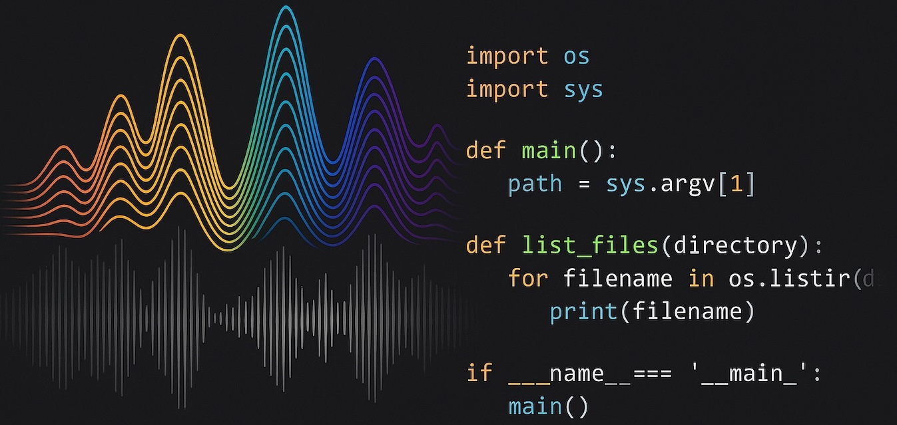

<!-- Profile README for github.com/Mamath79 -->

  

<h1 align="center">Hi, I'm Mathieu — Python Developer & Audio Engineer</h1>

  <a href="mailto:mathieu.vieillefont@gmail.com">Email</a> •
  <a href="https://www.linkedin.com/in/mathieu-vieillefont/">LinkedIn</a> •
  <a href="https://mamath79.github.io">Portfolio</a>

---

### 👋 About me
- 🔭 I build **Python / Django** back-ends, APIs and small tools.
- 🎧 I also work as an **audio engineer** (dubbing / post-production).
- 🧩 I enjoy clean architecture, testing, and pragmatic DevOps.
- 🌍 Based in France — open to remote & hybrid collaborations.

---

### 🛠️ Tech I use
`Python` · `Django/DRF` · `SQL (PostgreSQL/MySQL/SQLite)` · `Pytest` · `Docker` · `CI/CD (GitHub Actions)` · `Git` · `Linux/macOS`

<!-- Optional badges (uncomment if you like the visual style)

  
  
  
  
  

-->

---

### ⭐ Featured projects (OpenClassrooms)
- **SoftDesk Support API** — Django REST API with JWT & role-based permissions  
  🔗 https://github.com/Mamath79/oc-softdesk-support-api

- **Epic Events CRM (P12)** — Secure Python + SQL CLI with RBAC & SQLAlchemy  
  🔗 https://github.com/Mamath79/OC_P12_D-veloppez-une-architecture-back-end-securisee-avec-Python-et-SQL

- **Orange County Lettings (P13)** — Modularize a legacy **Django** monolith (apps split, CI, Docker)  
  🔗 https://github.com/Mamath79/Projet_13_Mettez_a_l_echelle_une_application_Django_en_utilisant_une_architecture_modulaire

- **Python Web App — Testing & Debugging (P11)** — add tests, fix bugs, improve logging  
  🔗 https://github.com/Mamath79/OC_P11_Ameliorez-une-application-Web-Python-par-des-tests-et-du-d-bogage

> All OC repos are **educational projects** — I keep them tidy for portfolio purposes.

---

### 🎧 Audio engineering (selected work)
Dubbing & post-production for films/series/documentaries.  
If you’re curious, ping me and I’ll share a short, rights-compliant reel.

---

### 📬 Contact
- ✉️ **mathieu.vieillefont@naxencia.com**
- 🔗 **LinkedIn**: linkedin.com/in/mathieu-vieillefont
- 🌐 **Portfolio**: mamath79.github.io

<!-- Optional GitHub stats (comment out if you prefer clean text)

  
  

-->
